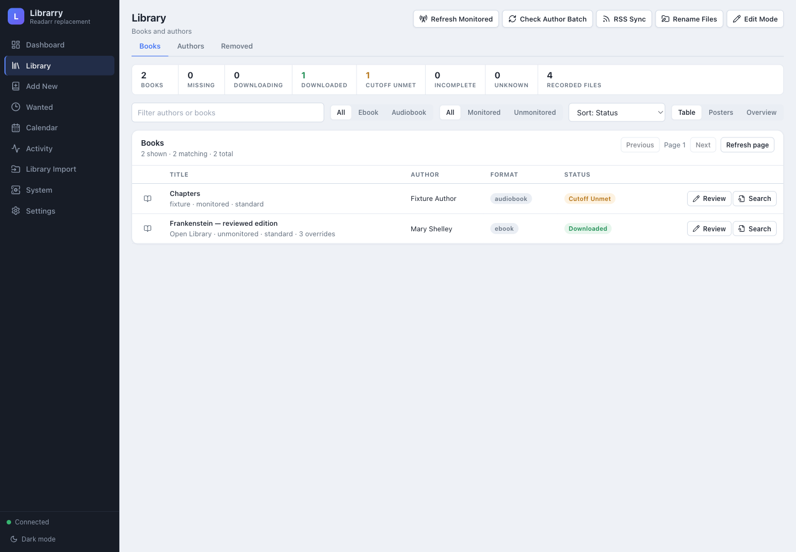

# Librarry

A self-hosted ebook and audiobook manager built around reliable metadata,
explainable release decisions, and recoverable library operations.

**Early alpha.** Librarry is intended to become a modern Readarr replacement.
The latest images contain the qualified stabilization update deployed on the
maintainer NAS. Longer-term observation and full Readarr migration qualification
remain incomplete. See [current status](docs/status.md) before migrating a library.



*Actual candidate UI with controlled test records, captured September 16, 2026.*

## What it does

- Search metadata with provider provenance, coherent edition evidence, and durable manual corrections. Hardcover Series mode uses source-reported positions (requires a token; live qualification pending).
- Track wanted books, monitor authors, and evaluate releases through Prowlarr.
- Download a selected book in one action using the best approved release, with qBittorrent, Transmission or SABnzbd.
- Import ebooks and chapter-based audiobooks, with explicit review for ambiguous
  files and saved recovery plans for interrupted work.
- Preserve book/file identity through verified imports, scans, renames and
  removal or restoration of tracking.
- Expose partial Readarr-compatible APIs and a migration preview/import surface.

Hardcover is the intended rich primary metadata source, Open Library the
credential-free backbone, Google Books an exact-match fallback, and embedded
file metadata import evidence. Download clients remain responsible for torrent
and Usenet administration. Readarr migration and full compatibility are not yet
qualified; see [limitations](docs/status.md#known-gaps).

## Install with Docker Compose

Librarry runs as three services: API, web and PostgreSQL 16. The application images
support Linux AMD64 and ARM64. Start from a checkout:

```bash
git clone https://github.com/bandoracer/librarry.git
cd librarry/deploy
cp .env.example .env
```

**Edit `.env` before starting:**

1. Replace the Postgres password and the matching password in
   `LIBRARRY_DATABASE_URL`. Use a URL-safe password or percent-encode it in the URL.
2. Keep `LIBRARRY_AUTH_METHOD=forms` and replace the browser username/password.
3. Set persistent database/config paths, the media mount and `LIBRARRY_RUN_USER`
   to match your filesystem permissions. Library and download paths must refer
   to the same files seen by your download client.
4. Set `LIBRARRY_WEB_ORIGIN` to the URL you will open.
5. Defaults use the current `latest` image pair. To pin the qualified build,
   use the paired immutable references in the [qualification report](docs/reviews/2026-09-16-release-qualification.md#published-artifact-identity).

Then, from `librarry/deploy`:

```bash
docker compose config -q
docker compose pull
docker compose up -d
docker compose ps
```

Open `http://127.0.0.1:30200` on the Docker host, or your configured URL. After
sign-in, verify roots and provider/client connections in Settings and System.
Open Library works without credentials. Scheduled automation defaults to
auto-grab; review the [automation controls](docs/deployment.md#stabilization-candidate-configuration)
before connecting indexers and download clients to an existing library.

For complete path, permissions, authentication, upgrade and restore instructions,
use the [deployment guide](docs/deployment.md).

| Installation | Guide |
| --- | --- |
| Generic Docker Compose | [Deployment](docs/deployment.md#generic-docker-compose) |
| TrueNAS SCALE Custom App | [TrueNAS](deploy/truenas/README.md) |
| Unraid Docker Compose Manager | [Unraid](deploy/unraid/README.md) |
| Build the checkout locally | [Local development](docs/local-dev.md) |

## Documentation

Start with the [documentation index](docs/README.md).

- [Current status and limitations](docs/status.md)
- [Provider setup](docs/provider-setup.md)
- [Library management](docs/guides/library.md) and [imports/recovery](docs/guides/imports.md)
- [Book acquisition](docs/guides/acquisition.md) and [monitoring](docs/guides/monitoring.md)
- [Authentication, backups and diagnostics](docs/guides/operations.md)
- [Architecture](docs/architecture.md) and [API reference](docs/reference/api.md)
- [Release checklist](docs/release-checklist.md) and [changelog](CHANGELOG.md)

## Contributing

Metadata edge cases, reproducible import failures, deployment feedback and
workflow improvements are especially useful. Read [CONTRIBUTING.md](CONTRIBUTING.md)
for setup, checks and pull-request expectations. Contributors use Go 1.26.8,
Node.js 22 and a disposable PostgreSQL 16 environment.

Use [GitHub issues](https://github.com/bandoracer/librarry/issues) for bugs and
feature requests. Follow [SECURITY.md](SECURITY.md) for sensitive reports.
Please do not add Goodreads, Amazon or Audible scraping to core.

## License

[GNU Affero General Public License v3.0](LICENSE).

## Kindle email delivery

Manual EPUB/PDF delivery, SMTP configuration, credential precedence, and recovery
are described in the [Kindle guide](docs/guides/kindle.md). Configure it under
Settings → Kindle. Delivery is disabled by default; it requires Postgres and an
authenticated TLS SMTP sender. New source builds include migration 0059; older
published images do not include this feature.
