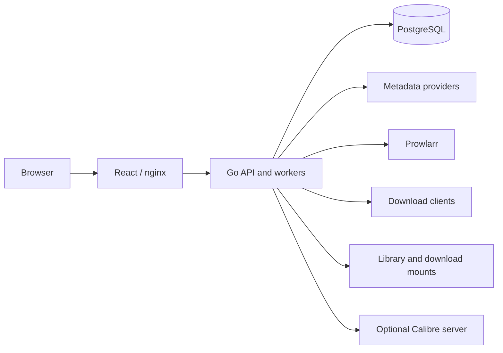

# Architecture

Librarry consists of a Go API/worker process, a React application and PostgreSQL.
The web container serves static assets through nginx and proxies API requests;
the browser talks to Librarry, not directly to metadata or download providers.

## Responsibilities

| Area | Location | Responsibility |
| --- | --- | --- |
| Process | `backend/cmd/librarry` | Startup, configuration, migrations and worker wiring |
| HTTP | `backend/internal/api` | Native routes, authentication and Readarr-compatible adapters |
| Metadata | `backend/internal/metadata` | Provider requests, normalization, matching and provenance |
| Tracking | `backend/internal/wanted` | Wanted books, authors, release evaluation and review |
| Acquisition | `backend/internal/acquisition` | Prowlarr and external download-client contracts |
| Library | `backend/internal/library` | Scans, import plans, file identity, rename and Calibre handoff |
| Compatibility | `backend/internal/compat` | Persisted resource/config adapters and restrictions |
| Persistence | `backend/migrations` | Append-only PostgreSQL migrations |
| UI | `web/src` | Routes, query state and operator review flows |

## Data and identity

The canonical model separates authors, works, editions, wanted items and files.
Provider records retain upstream IDs and raw evidence. Manual overrides take
precedence when records are merged or refreshed. A title match alone is not a
book identity; ebook and audiobook targets remain distinct.

Relational file/book/download links preserve ownership independently of display
metadata. Book status is derived from recorded file presence and complete import
manifests. An unavailable root or client cannot establish that a book is missing.
See [metadata contracts](reference/metadata.md) and
[collection/evidence contracts](reference/collections.md).

## Workflow boundaries

1. Search providers and select a metadata identity and format.
2. Persist a wanted item with its root, profile, tags and monitoring policy.
3. Evaluate indexer releases with explainable acceptance/rejection reasons.
4. Persist acquisition intent and client receipts; reconcile uncertain acceptance
   before another submission.
5. Inspect the exact completed payload. Ambiguous sets require file assignments
   and a current destination preview.
6. Journal and verify filesystem work before committing file identities and
   associations. Preserve original bytes until safe cleanup is established.

[Acquisition contracts](reference/acquisition.md) and
[file integrity contracts](reference/files.md) describe claims, leases, retry,
replacement and cleanup boundaries. Download clients handle transfer protocols;
Librarry handles the book acquisition and import lifecycle.

## Authentication and background work

Forms and Basic authentication require usable persisted credentials. An API key
can authorize compatible clients independently of the browser's session method.
Requested authentication fails closed on invalid configuration or persistence
failure. Static UI assets are served by nginx; API authentication protects data
and actions. See [operator authentication](guides/operations.md#authentication).

Workers coordinate ownership and schedules through PostgreSQL. Persisted history
separates successful, degraded, failed and interrupted runs. Notifications use a
durable outbox; an uncertain send requires review instead of automatic replay.
Use a direct or session-pooled database connection for advisory-lock ownership.
See [worker/authentication/notification contracts](reference/operations.md).

## Interfaces and qualification

- [API route reference](reference/api.md): native and compatible routes.
- [Frontend architecture](frontend.md): navigation, server state and demo boundaries.
- [Operator guides](README.md#operate): settings and recovery procedures.
- [Current status](status.md): what has actually been qualified and deployed.

Compatibility is partial. An implemented route does not establish full Readarr
semantics or migration readiness. New persistence changes must be append-only;
new operations need explicit identity, stale-review and failure behavior.
